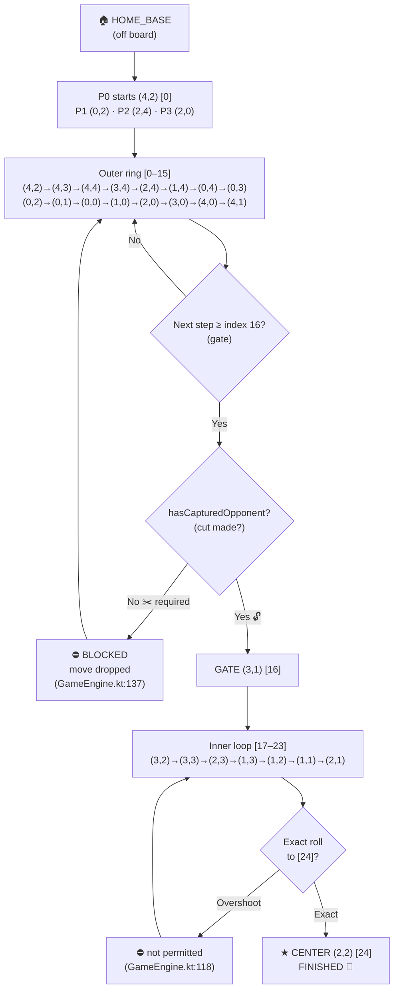
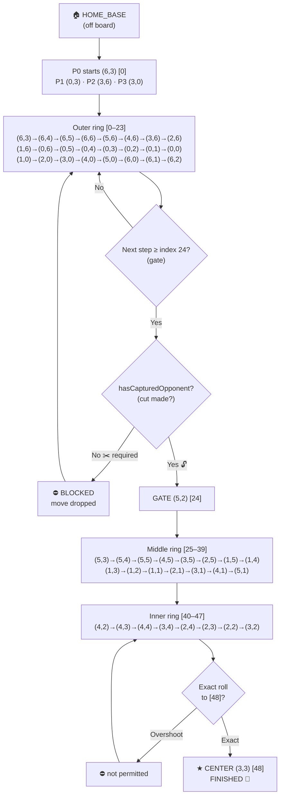

# Choka Barah (Chowka Bara / Ashta Chamma) - Complete Rules & Specification Document

> **Source References:**
> - 5-House (5×5) Rules: https://rollthedice.in/pages/how-to-play-chowka-bara-5-house
> - 7-House (7×7) Rules: https://rollthedice.in/pages/how-to-play-chowka-bara-7-house
> - Implementation: Android (Jetpack Compose) + Web (HTML/CSS/JS)

---

## Table of Contents

1. [Game Overview](#1-game-overview)
2. [Board Layouts](#2-board-layouts)
3. [Cowry Shell Scoring](#3-cowry-shell-scoring)
4. [Core Gameplay Rules](#4-core-gameplay-rules)
5. [Special Mechanics](#5-special-mechanics)
5. [Victory Conditions](#6-victory-conditions)
7. [Edge Cases & Corner Cases](#7-edge-cases--corner-cases)
8. [User Stories & Acceptance Criteria](#8-user-stories--acceptance-criteria)
9. [Implementation Notes](#9-implementation-notes)

---

## 1. Game Overview

**Chowka Bara** (also known as **Ashta Chamma** in the 7×7 variant, **Chauka Bara**, **Katte Mane**, **Gatta Mane**) is a traditional Indian race board game for 2–4 players. It is a game of chance (cowry shells) and strategy (pawn movement, Gatti formation, capture timing).

| Variant | Board | Cowries | Pawns/Player | Total Cells (per player) | Outer Track | Inner Track |
|---------|-------|---------|--------------|--------------------------|-------------|-------------|
| **5-House** | 5×5 grid | 4 | 4 | 25 (16 outer + 8 inner + 1 center) | 16 cells | 8 cells + center |
| **7-House** | 7×7 grid | 6 | 4 | 49 (24 outer + 24 inner + 1 center) | 24 cells | 24 cells + center |

**Players:** 2–4 (Red/South, Green/North, Yellow/East, Blue/West)  
**Objective:** Be the first to move all 4 pawns from Home Base → Outer Track → Inner Track → Center Home.

---

## 2. Board Layouts

### 2.1 5×5 Board (5-House / Chowka Bara)

```
Row/Col:   0   1   2   3   4
         ┌───┬───┬───┬───┬───┐
       0 │   │   │ H │   │   │  ← North (Green) Home at (0,2)
         ├───┼───┼───┼───┼───┤
       1 │   │   │   │   │   │
         ├───┼───┼───┼───┼───┤
       2 │ H │   │ C │   │ H │  ← West (Blue) at (2,0), East (Yellow) at (2,4)
         ├───┼───┼───┼───┼───┤
       3 │   │   │   │   │   │
         ├───┼───┼───┼───┼───┤
       4 │   │   │ H │   │   │  ← South (Red) Home at (4,2)
         └───┴───┴───┴───┴───┘

Legend:  H = Player Home (Safe)  |  C = Center Home (Safe)
```

**Safe Squares (5×5):**
- 4 Player Home squares: (4,2) Red, (0,2) Green, (2,4) Yellow, (2,0) Blue
- Center Home: (2,2)
- **Total: 5 safe squares**

> **⚠️ Correction (implementation-verified):** Corners `(0,0),(0,4),(4,0),(4,4)` are **NOT safe** in the 5-house variant — only the 4 homes + center are safe. Corner safes (`X`) are introduced **only in the 7×7 variant** (see §2.2 and §5.3).

**Path per player (25 cells):** 16 outer → 8 inner → 1 center

---

### 2.2 7×7 Board (7-House / Ashta Chamma)

```
Row/Col:   0   1   2   3   4   5   6
         ┌───┬───┬───┬───┬───┬───┬───┐
       0 │ X │   │   │ H │   │   │ X │  ← Green Home (0,3)
         ├───┼───┼───┼───┼───┼───┼───┤
       1 │   │ X │   │   │   │ X │   │  ← Diagonal safe (1,1) (1,5)
         ├───┼───┼───┼───┼───┼───┼───┤
       2 │   │   │   │   │   │   │   │
         ├───┼───┼───┼───┼───┼───┼───┤
       3 │ H │   │   │ C │   │   │ H │  ← Blue (3,0), Yellow (3,6)
         ├───┼───┼───┼───┼───┼───┼───┤
       4 │   │   │   │   │   │   │   │
         ├───┼───┼───┼───┼───┼───┼───┤
       5 │   │ X │   │   │   │ X │   │  ← Diagonal safe (5,1) (5,5)
         ├───┼───┼───┼───┼───┼───┼───┤
       6 │ X │   │   │ H │   │   │ X │  ← Red Home (6,3)
         └───┴───┴───┴───┴───┴───┴───┘

Legend:  H = Player Home (Safe)  |  X = Safe Square  |  C = Center Home (Safe)
```

**Safe Squares (7×7) — ✕ Pattern (Diagonal), NOT + Pattern:**
- 4 Player Home squares (edge midpoints): (6,3) Red, (0,3) Green, (3,6) Yellow, (3,0) Blue
- 4 Outer Corners: (0,0), (0,6), (6,0), (6,6)
- 4 Inner Diagonal squares: (1,1), (1,5), (5,1), (5,5) ← **CRITICAL: ✕ pattern**
- Center Home: (3,3)
- **Total: 13 safe squares**

**Path per player (49 cells):** 24 outer → 24 inner → 1 center

> **⚠️ Common Implementation Error:** Many implementations incorrectly use a `+` pattern for inner safe squares (i.e., (1,3), (3,1), (3,5), (5,3)). The **official board uses ✕ pattern** — diagonal squares only.

---

## 3. Cowry Shell Scoring

### 3.1 Shell Mechanics
- Each cowry shell has two states: **Mouth UP** (open) or **Mouth DOWN** (closed)
- All shells are tossed simultaneously
- Count of **Mouth UP** shells determines the score

### 3.2 Scoring Tables

#### 5-House (4 Cowries)

| Mouths Up | Score | Name | Extra Roll? |
|-----------|-------|------|-------------|
| 0 | **8** | **Baara** | ✅ Yes |
| 1 | 1 | — | ❌ No |
| 2 | 2 | — | ❌ No |
| 3 | 3 | — | ❌ No |
| 4 | **4** | **Chowka** | ✅ Yes |

#### 7-House (6 Cowries)

| Mouths Up | Score | Name | Extra Roll? |
|-----------|-------|------|-------------|
| 0 | **12** | **Baara** | ✅ Yes |
| 1 | 1 | — | ❌ No |
| 2 | 2 | — | ❌ No |
| 3 | 3 | — | ❌ No |
| 4 | 4 | — | ❌ No |
| 5 | 5 | — | ❌ No |
| 6 | **6** | **Chowka** | ✅ Yes |

### 3.3 Extra Roll Rules
- **Chowka** (max mouths up) and **Baara** (zero mouths up) grant an **extra roll**
- Extra rolls **chain**: if you roll Chowka/Baara again on the extra roll, you get another extra roll
- If an extra roll yields **no valid moves**, the extra roll is **consumed** and the **same player re-rolls** — the turn is **not** passed (see US-08 and EC-01). Only a **non-extra** roll with no moves passes the turn.
- **No limit** on chained extra rolls

---

## 4. Core Gameplay Rules

### 4.1 Turn Structure
1. **Roll** cowry shells
2. **Check valid moves** for the rolled score
3. **If no valid moves:** Turn ends (unless extra roll → re-roll)
4. **Select** a pawn/pawn-group to move
5. **Execute move** (advance, capture, enter inner track, reach home)
6. **Check victory**
7. **If capture or extra roll:** Current player rolls again (go to step 1)
8. **Else:** Turn passes to next player (clockwise: Red → Green → Yellow → Blue)

### 4.2 Pawn States
| State | Description |
|-------|-------------|
| `HOME_BASE` | Pawn in starting area, not yet on board |
| `ON_TRACK` | Pawn actively moving on outer/inner track |
| `FINISHED` | Pawn reached center home (removed from board) |

### 4.3 Movement Rules

#### Entering the Board (Home Base → Track)
- A pawn in `HOME_BASE` enters at its **player's home square** (path index 0)
- **Movement calculation:** `targetIndex = rollValue - 1`
  - Example: Roll 3 → pawn enters at index 0, advances 2 more steps → lands at index 2
  - Roll 1 → pawn enters at index 0 (home square) and stays there
- **Only ONE pawn enters per roll** — pawns in home base are **never grouped** as Gatti

#### Moving on Track
- Pawns move **anti-clockwise** along their player-specific path
- Path is a fixed sequence of coordinates generated by rotating the base loop
- **Single pawn:** Moves exactly `rollValue` steps forward
- **Gatti group (2+ pawns on same cell):** Entire group moves together as one unit

#### Inner Track Gate (Critical Rule)
- **Inner track is locked** until the player has **captured at least one opponent pawn** ("made a cut")
- Gate index: 5×5 = 16, 7×7 = 24 (first cell of inner loop)
- If `hasCapturedOpponent == false` and `targetIndex >= gateIndex`: **Move is ILLEGAL**
- Capturing on the outer track unlocks the gate **immediately** for subsequent moves in the same turn (if extra roll)

#### Reaching Center Home
- Center home is the **last cell** of the player's path (index = path.length - 1)
- Pawn must land **exactly** on center home (no overshoot allowed)
- On reaching center: pawn state → `FINISHED`, removed from board
- **No extra turn** for reaching center (unless the roll was Chowka/Baara or a capture occurred)

#### Pawn Journey Diagrams (Outer Track → Inner Track → Home)

##### 5×5 — 25 cells, gate at index 16


##### 7×7 — 49 cells, gate at index 24


---

## 5. Special Mechanics

### 5.1 Gatti (Pawn Grouping) — "Gatti" = "Knot/Bundle"

#### Formation
- When **2 or more of YOUR pawns** occupy the **same cell** (after a move), they form a **Gatti**
- Gatti can form on **any cell** (safe or unsafe)
- Gatti formation does **not** grant extra turn

#### Movement
- Gatti moves as a **single unit** — all pawns in group advance together
- Requires **exact roll** to move the entire group (cannot split)
- If roll would overshoot for any pawn in group, **entire group cannot move**

#### Capture Immunity (Traditional Rule)
> **A Gatti (2+ pawns) CANNOT BE CAPTURED BY ANYONE — not even by another Gatti.**

| Attacker | Defender | Result |
|----------|----------|--------|
| Single | Single | Capture ✅ |
| Single | Gatti (2+) | **Blocked ❌** |
| Gatti | Single | Capture ✅ |
| Gatti | Gatti | **Blocked ❌** |

> **Note:** This is the traditional rule per rollthedice.in and most regional variants. Some house rules allow Gatti-vs-Gatti capture; we follow the strict traditional rule.

#### Safe Square + Gatti
- On a safe square, multiple players' pawns can coexist
- A Gatti on a safe square is **doubly protected** (safe square + Gatti immunity)
- Opponents can land on same safe square — no capture occurs

#### Breaking a Gatti
- Gatti **cannot be voluntarily split**
- Only way to break: capture (impossible per rules) or reaching center home (pawns finish individually)

---

### 5.2 Capture ("Cut")

#### Conditions for Capture
1. Moving pawn/group lands on cell occupied by **opponent pawn(s)**
2. Target cell is **NOT a safe square**
3. Opponent has **NO Gatti** on that cell (single pawn only)
4. Moving player's pawn(s) can be single or Gatti — both can capture

#### Capture Effects
- Captured opponent pawn(s) → `HOME_BASE` (pathIndex = -1)
- Capturing player: `hasCapturedOpponent = true` (unlocks inner gate)
- **Extra turn granted** (roll again)
- Multiple opponent pawns on same unsafe cell (from different players) → **ALL captured**

#### Home Base Safety
- Pawns in `HOME_BASE` **cannot be captured**
- They are not on the board

#### Safe Square Immunity
- On safe squares: **no capture ever occurs**
- Multiple players' pawns coexist peacefully
- Gatti on safe square = maximum protection

---

### 5.3 Safe Squares Summary

| Variant | Player Homes | Corners | Inner Diagonal | Center | Total |
|---------|--------------|---------|----------------|--------|-------|
| 5×5 | 4 | 0 | 0 | 1 | **5** |
| 7×7 | 4 | 4 | **4 (✕ pattern)** | 1 | **13** |

**On Safe Squares:**
- ✅ Multiple players' pawns coexist
- ✅ No capture possible
- ✅ Gatti formation allowed
- ✅ Pawns can pass through freely

---

## 6. Victory Conditions

- **Win:** First player to move **all 4 pawns** to `FINISHED` state (center home)
- **Game ends immediately** on victory
- **No continuation** for 2nd/3rd place (traditional)
- Victory message displayed; option to start new game

---

## 7. Edge Cases & Corner Cases

This section covers all identified edge cases that must be handled correctly.

### 7.1 Cowry Roll Edge Cases

| # | Scenario | Expected Behavior |
|---|----------|-------------------|
| EC-01 | Roll Chowka/Baara but **no valid moves** exist | Extra roll **consumed**; log: "No valid moves!". The **same player re-rolls** (an extra roll does not end the turn — per US-08). A NON-extra roll with no moves passes the turn. |
| EC-02 | Roll Chowka/Baara → move → roll again Chowka/Baara → no moves | Second extra roll consumed; same player re-rolls again |
| EC-03 | Multiple chained extra rolls (e.g., Chowka → Chowka → 3 → move) | All extra rolls honored; player keeps rolling until non-extra or no-moves |
| EC-04 | Roll score > remaining steps to center (overshoot) | Move **invalid** — pawn cannot overshoot center |
| EC-05 | All pawns finished except one, roll exceeds steps to center | No valid move for that pawn; if no other pawns can move → no valid moves |
| EC-06 | Roll 1 with pawn on home square (index 0) | Pawn stays on home square (valid move, 0 advancement) |

### 7.2 Movement Edge Cases

| # | Scenario | Expected Behavior |
|---|----------|-------------------|
| EC-07 | Pawn in HOME_BASE, roll = 1 | Pawn enters at index 0 (home square), stays there |
| EC-08 | Pawn in HOME_BASE, roll = 8 (5×5 Baara) | Pawn enters at index 0, advances 7 → lands at index 7 |
| EC-09 | Pawn in HOME_BASE, roll would land **at or past inner gate** but no cut yet | **Move invalid** — cannot enter inner track without cut |
| EC-10 | Player has cut, pawn at index 15 (5×5), roll = 2 → target = 17 (inner track) | **Valid** — gate unlocked, enters inner track |
| EC-11 | Player has NO cut, pawn at index 15 (5×5), roll = 1 → target = 16 (gate) | **Invalid** — gate is at index 16, blocked |
| EC-12 | Gatti group at index 14, roll = 2, has cut → target = 16 (gate) | **Valid** — entire group enters inner track together |
| EC-13 | Gatti group at index 14, roll = 2, NO cut → target = 16 | **Invalid** — entire group blocked at gate |
| EC-14 | Two separate pawns (not Gatti) can move with same roll | Both appear as separate valid moves; player chooses one |

### 7.3 Gatti Edge Cases

| # | Scenario | Expected Behavior |
|---|----------|-------------------|
| EC-15 | Two pawns land on same cell via **different rolls** (not same move) | **Gatti forms** — they become a group for future moves |
| EC-16 | Three pawns on same cell (two from before + one arriving) | Gatti of 3 forms |
| EC-17 | Gatti on safe square, opponent lands there | Coexist — no capture |
| EC-18 | Gatti on unsafe square, opponent single pawn lands there | **Capture by opponent** (Gatti can be captured? NO — Gatti is immune!) |
| EC-19 | Gatti on unsafe square, opponent Gatti lands there | **Both blocked** — no capture, move invalid for attacker |
| EC-20 | Gatti formation on **winning move** (last pawn joins group at center) | Gatti forms, then pawns finish individually — victory still triggers |
| EC-21 | Pawn reaches center home while in Gatti | That pawn finishes; remaining pawns stay as smaller Gatti |
| EC-22 | Attempt to move Gatti but roll would overshoot for one pawn | **Entire group blocked** — no partial movement |

### 7.4 Capture Edge Cases

| # | Scenario | Expected Behavior |
|---|----------|-------------------|
| EC-23 | Capture on opponent's home square (safe) | **Impossible** — home squares are safe |
| EC-24 | Capture on center home (safe) | **Impossible** — center is safe |
| EC-25 | Moving Gatti captures single opponent | **Valid** — Gatti captures, extra turn |
| EC-26 | Single pawn captures opponent who has 2 pawns on same cell (different players) | **Both captured** — all opponent pawns on that cell go home |
| EC-27 | Capture unlocks gate → same turn extra roll → move into inner track | **Valid** — gate unlocked immediately after capture |
| EC-28 | Capture on cell where opponent has Gatti | **Invalid move** — blocked, not a valid move option |

### 7.5 Turn Flow Edge Cases

| # | Scenario | Expected Behavior |
|---|----------|-------------------|
| EC-29 | Roll (non-extra) with no valid moves → turn passes | Next player rolls |
| EC-30 | Roll Chowka → no valid moves → re-roll (extra) → valid move → move → extra roll again | Extra roll chain continues correctly |
| EC-31 | Bot's turn, roll → no valid moves | Bot re-rolls if extra, else passes turn |
| EC-32 | Bot has multiple valid moves with same priority | Bot picks first in priority order (deterministic) |
| EC-33 | Player closes app mid-turn | State persisted? (Implementation dependent) |
| EC-34 | 3+ players, turn order after player wins | Game ends — no further turns |

### 7.6 Board Geometry Edge Cases

| # | Scenario | Expected Behavior |
|---|----------|-------------------|
| EC-35 | 7×7 inner safe squares at (1,3), (3,1), etc. (+ pattern) | **WRONG** — must be (1,1), (1,5), (5,1), (5,5) (✕ pattern) |
| EC-36 | Path rotation for each player correct? | Verified: 5×5 offsets {0,8,4,12}, 7×7 offsets {0,12,6,18} |
| EC-37 | Outer loop direction: counter-clockwise? | Verified: both boards use counter-clockwise outer loop |
| EC-38 | Inner loop direction? | Continues counter-clockwise from gate |

### 7.7 Multiplayer / Pass-and-Play Edge Cases

| # | Scenario | Expected Behavior |
|---|----------|-------------------|
| EC-39 | Pass-and-play: device rotated mid-game | UI adapts; board orientation stays consistent |
| EC-40 | Player taps invalid cell | No action; valid moves highlighted |
| EC-41 | Player taps own pawn not in valid moves | No action; quick-select bar shows valid pawns |
| EC-42 | Quick-select pawn list: Gatti group shown as single entry | Shows group with count indicator |

---

## 8. User Stories & Acceptance Criteria

### Epic 1: Game Setup & Configuration

| ID | User Story | Acceptance Criteria |
|----|------------|---------------------|
| US-01 | As a player, I want to choose between 5×5 and 7×7 board | • Toggle/button to select grid size<br>• Default: 5×5<br>• Board, cowries, paths update immediately |
| US-02 | As a player, I want to choose 2, 3, or 4 players | • Player count selector (2–4)<br>• Colors assigned: 2→Red/Green, 3→+Yellow, 4→+Blue<br>• Bot slots configurable for VS Bot mode |
| US-03 | As a player, I want to choose Pass-and-Play or VS Bot | • Mode selector on home screen<br>• VS Bot: 1 human + 1–3 bots<br>• Pass-and-Play: 2–4 humans |
| US-04 | As a player, I want to see player names/colors | • Display: "Red (South)", "Green (North)", etc.<br>• Color-coded UI elements |

---

### Epic 2: Rolling Cowries

| ID | User Story | Acceptance Criteria |
|----|------------|---------------------|
| US-05 | As a player, I want to roll cowries on my turn | • "Roll" button enabled only on current player's turn<br>• Animation: shells tumble, settle showing mouths up/down<br>• Sound effect on roll |
| US-06 | As a player, I want to see the roll result and score | • Display: individual shell states (⚪/⚫)<br>• Display: score label ("CHOWKA (4) — EXTRA ROLL!", "Score: 3", "BAARA (8)")<br>• Highlight if extra roll |
| US-07 | As a player, I want extra rolls to work automatically | • Chowka/Baara → "Extra roll!" message<br>• Roll button stays enabled for same player<br>• Chain multiple extra rolls correctly |
| US-08 | As a player, I want to re-roll if extra roll has no moves | • If Chowka/Baara but no valid moves → "No valid moves! Roll again."<br>• Roll button enabled for same player<br>• Previous extra roll consumed |

---

### Epic 3: Pawn Movement

| ID | User Story | Acceptance Criteria |
|----|------------|---------------------|
| US-09 | As a player, I want to see valid moves highlighted | • After roll, valid destination cells highlighted<br>• Pawns that can move show indicator<br>• Gatti groups shown as single movable unit |
| US-10 | As a player, I want to select a pawn to move | • Tap pawn → selects it (if valid)<br>• Tap destination cell → moves selected pawn<br>• Quick-select bar shows all movable pawns/groups |
| US-11 | As a player, I want to bring a pawn onto the board | • Tap "Roll" → if roll allows entry, home-base pawn appears in quick-select<br>• Tap to bring onto board at correct index (roll-1)<br>• Only ONE pawn enters per roll |
| US-12 | As a player, I want Gatti groups to move together | • 2+ pawns on same cell → move as one<br>• Single tap on any group member selects whole group<br>• Group moves exactly rollValue steps together |
| US-13 | As a player, I want the inner gate to enforce cut rule | • No cut made → pawns cannot enter inner track (gate index)<br>• Visual indicator: "🔒 Inner path locked — make a cut!"<br>• After first capture → gate unlocks immediately |

---

### Epic 4: Capture & Gatti Mechanics

| ID | User Story | Acceptance Criteria |
|----|------------|---------------------|
| US-14 | As a player, I want to capture opponent pawns | • Land on opponent single pawn on unsafe square → capture<br>• Captured pawn returns to home base (animation)<br>• "✂️ CUT!" message + extra turn<br>• Inner gate unlocks for capturer |
| US-15 | As a player, I want safe squares to prevent capture | • Landing on safe square with opponents → coexist, no capture<br>• Multiple players' pawns visible on safe square<br>• No extra turn for safe-square landing |
| US-16 | As a player, I want Gatti to be capture-immune | • 2+ own pawns on same cell → Gatti formed ("🔗 GATTI!")<br>• Opponent single pawn CANNOT capture Gatti (move invalid)<br>• Opponent Gatti CANNOT capture Gatti (move invalid)<br>• Gatti CAN capture single opponent pawn |
| US-17 | As a player, I want to see Gatti status clearly | • Gatti cells show stacked/bundled pawn visual<br>• Log message on formation<br>• Group moves as unit in quick-select |

---

### Epic 5: Victory & Game End

| ID | User Story | Acceptance Criteria |
|----|------------|---------------------|
| US-18 | As a player, I want to win by getting all 4 pawns home | • Last pawn reaches center → "🎉 VICTORY! [Player] wins!"<br>• Game ends immediately<br>• Winner color/name prominent |
| US-19 | As a player, I want Gatti message preserved on winning move | • If Gatti forms on winning move → "🔗 GATTI! ... 🎉 VICTORY!"<br>• Both messages shown |
| US-20 | As a player, I want to start a new game | • "New Game" button on victory screen<br>• Resets all state (board, scores, turns)<br>• Returns to home screen or restarts same config |

---

### Epic 6: Bot AI (VS Bot Mode)

| ID | User Story | Acceptance Criteria |
|----|------------|---------------------|
| US-21 | As a player, I want bot to make reasonable moves | • Priority: Capture > Reach Home > Safe Square > Advance Gatti > Furthest Pawn<br>• Bot rolls automatically after short delay (1–2 sec)<br>• Bot handles extra rolls correctly |
| US-22 | As a player, I want bot to handle no-move extra rolls | • Bot rolls Chowka/Baara → no moves → bot re-rolls automatically<br>• No UI freeze or stuck state |
| US-23 | As a player, I want bot to respect all rules | • Bot never makes illegal moves (gate, overshoot, Gatti capture)<br>• Bot forms Gatti when beneficial<br>• Bot captures when possible |

---

### Epic 7: UI/UX Polish

| ID | User Story | Acceptance Criteria |
|----|------------|---------------------|
| US-24 | As a player, I want clear turn indication | • Current player's color highlighted<br>• "Player X's turn! Roll cowries." in log<br>• Roll button colored for current player |
| US-25 | As a player, I want to see game log/history | • Scrollable log of last 10–20 events<br>• Rolls, moves, captures, Gatti, victory<br>• Timestamps optional |
| US-26 | As a player, I want responsive board on all screens | • Board scales to fit width<br>• Pawns remain circular<br>• Tap targets ≥ 48dp |
| US-27 | As a player, I want sound feedback | • Cowry roll sound<br>• Pawn move sound<br>• Capture sound<br>• Victory fanfare<br>• Mute toggle |

---

## 9. Implementation Notes

### 9.1 Key Data Structures (from GameModels.kt)

```kotlin
enum class GridSize { FIVE_BY_FIVE(5), SEVEN_BY_SEVEN(7) }
enum class PlayerColor { RED(0), GREEN(1), YELLOW(2), BLUE(3) }
enum class PawnState { HOME_BASE, ON_TRACK, FINISHED }

data class Pawn(
    val id: Int,
    val playerIndex: Int,
    var state: PawnState = HOME_BASE,
    var pathIndex: Int = -1
)

data class MoveOption(
    val grpPawns: List<Pawn>,        // Group (1 for single, 2+ for Gatti)
    val targetPathIndex: Int,
    val targetCoords: Pair<Int, Int>,
    val isCapture: Boolean,
    val reachesHome: Boolean,
    val isGattiGroup: Boolean
)

data class CowryResult(
    val shells: List<Boolean>,       // true = mouth UP
    val score: Int,
    val isExtraRoll: Boolean,
    val label: String
)
```

### 9.2 Critical Engine Methods (GameEngine.kt)

| Method | Purpose |
|--------|---------|
| `rollCowries()` | Generates roll, calculates valid moves, handles extra-roll no-move case |
| `calculateValidMoves(score)` | Core move logic: grouping, gate check, capture rules, Gatti immunity |
| `executeMove(MoveOption)` | Applies move, handles capture, Gatti formation, victory, turn advance |
| `getBestBotMove()` | AI priority: capture → home → safe → Gatti → furthest |
| `advanceTurn()` | Increments player index, resets roll/moves |

### 9.3 TrackBuilder (TrackBuilder.kt)

| Method | Purpose |
|--------|---------|
| `getPlayerPath(gridSize, playerIndex)` | Returns full path (List<Pair<Int,Int>>) for player |
| `innerGateIndex(gridSize)` | Gate index: 16 (5×5) or 24 (7×7) |
| `isSafeCell(gridSize, row, col)` | **Critical**: ✕ pattern for 7×7 inner safes |

### 9.4 Sound Feedback (US-27) – `sound.js` / `GameAudio`

Implemented as a **pure, dependency-injected audio core** so the event → sound mapping
and mute-gating logic are unit-testable in Node/Jest (audio itself is never touched by
automated tests — see test doc §8.4).

| Sound event | Plays when | Tone |
|-------------|-----------|------|
| `roll` | Cowries are rolled | 523 Hz |
| `move` | A pawn is moved (no capture/Gatti/victory) | 460 Hz |
| `capture` | A capture happens (extra turn granted) | 170 Hz |
| `gatti` | A Gatti is formed by landing on an occupied cell | 760 Hz |
| `victory` | A player moves all 4 pawns to Center Home | 988 Hz |
| `extra_roll` | Extra roll granted (Chowka/Baara) | 620 Hz |
| `invalid` | Roll produces no valid moves | 130 Hz |
| `game_start` | A game begins / restarts | 440 Hz |

- Sink contract: `{ play(effect: { tone }) -> bool }`. Web Audio (`AudioContext`)
  sink falls back to a no-op sink when the platform has no audio (headless CI/SSR).
- **Mute toggle** (US-27): `Sound.toggleMute()` suppresses all playback; the UI
  button (`#btn-mute`) reflects 🔊/🔇 state.
- Web integration points in `app.js`: roll → `Sound.play('roll')`; move execution →
  `victory` > `capture` > `gatti` > `move` priority; no-valid-moves → `invalid`;
  game start → `game_start`.
- Android equivalent: `GameAudio` (sound event enum + muted flag + sink interface).

### 9.4 Known Bugs Fixed (Historical)

| Bug | Fix |
|-----|-----|
| Home-base pawns grouped as single Gatti | Each base pawn gets unique key `HOME_${id}` |
| `MoveOption.pawn` referenced but doesn't exist | UI updated to use `grpPawns[0]` |
| Extra roll with no moves didn't clear `currentRoll` | Clear `currentRoll = null` when `validMoves.isEmpty()` |
| Gatti-vs-Gatti capture allowed | Block all captures against opponent Gatti (size ≥ 2) |
| Gatti message lost on victory | Preserve Gatti message, append victory |
| 7×7 inner safe squares used + pattern | Corrected to ✕ pattern: (1,1), (1,5), (5,1), (5,5) |

### 9.5 Testing Checklist (All Edge Cases)

- [ ] EC-01 to EC-42 all pass
- [ ] 2-player, 3-player, 4-player games
- [ ] Pass-and-play and VS Bot modes
- [ ] 5×5 and 7×7 boards
- [ ] All Chowka/Baara extra roll chains
- [ ] Gate locked → unlocked transition
- [ ] Gatti formation, movement, immunity
- [ ] Capture on all square types
- [ ] Victory with/without Gatti on final move
- [ ] Bot plays legal moves in all scenarios
- [ ] UI state consistent after each action
- [ ] No memory leaks / crashes on rapid taps

---

## Appendix A: Quick Reference Card

### 5×5 Quick Reference
- **Cowries:** 4
- **Chowka:** 4 mouths up = 4 points + extra roll
- **Baara:** 0 mouths up = 8 points + extra roll
- **Outer track:** 16 cells
- **Gate index:** 16
- **Inner track:** 8 cells + center
- **Total path:** 25 cells
- **Safe squares:** 5 (4 homes, 1 center — corners NOT safe in 5×5)

### 7×7 Quick Reference
- **Cowries:** 6
- **Chowka:** 6 mouths up = 6 points + extra roll
- **Baara:** 0 mouths up = 12 points + extra roll
- **Outer track:** 24 cells
- **Gate index:** 24
- **Inner track:** 24 cells + center
- **Total path:** 49 cells
- **Safe squares:** 13 (4 homes, 4 corners, 4 diagonal inner, 1 center)
- **Inner safe pattern:** ✕ at (1,1), (1,5), (5,1), (5,5)

---

## Appendix B: Roll Probability (Theoretical)

Assuming fair cowries (50/50 per shell):

### 5×5 (4 shells)
| Score | Probability |
|-------|-------------|
| 1 | 25% (4/16) |
| 2 | 37.5% (6/16) |
| 3 | 25% (4/16) |
| 4 (Chowka) | 6.25% (1/16) |
| 8 (Baara) | 6.25% (1/16) |

### 7×7 (6 shells)
| Score | Probability |
|-------|-------------|
| 1 | 9.375% (6/64) |
| 2 | 23.4375% (15/64) |
| 3 | 31.25% (20/64) |
| 4 | 23.4375% (15/64) |
| 5 | 9.375% (6/64) |
| 6 (Chowka) | 1.5625% (1/64) |
| 12 (Baara) | 1.5625% (1/64) |

> **Note:** Real cowry shells are **not** perfectly fair — they tend to land mouth-up more often (~55-60%). Digital implementation uses fair RNG.

---

*Document Version: 1.0*  
*Last Updated: Based on codebase review and rollthedice.in rules*  
*Covers: Android (Kotlin/Compose) + Web (JS) implementations*